# L U M I N A — GL
### 001 // ADVANCED OPTICAL SHADERS & INTERACTIVE REFRACTION

**A curated laboratory of high-end image distortion techniques, exploring the boundaries of Chromatic Aberration, Fluid Dynamics, and Kinetic Momentum.**

[ [LAUNCH GALLERY](https://lumina-gl.sujitkoji.com/) ] &nbsp; • &nbsp; [ [SOURCE CODE](https://github.com/sujitkoji/lumina-gl) ]

 

 

---

### / THE CONCEPT

**LUMINS GL** is a technical study in **Creative Engineering**. Unlike standard galleries, this project focuses on the "Physicality of Light"—simulating how glass, speed, and fluid medium distort digital imagery in real-time.

By offloading complex pixel-sorting and RGB shifting to custom **GLSL Fragment Shaders**, we achieve cinematic 60FPS interactions that react to user intent and velocity.

---

### / LIVE EXPERIMENTS

<table width="100%" style="border-collapse: collapse; text-align: center;">
  <tr style="background: #0a0a0a;">
    <th style="border: 1px solid #1a1a1a; padding: 15px;">MODULE</th>
    <th style="border: 1px solid #1a1a1a; padding: 15px;">TECHNICAL FOCUS</th>
    <th style="border: 1px solid #1a1a1a; padding: 15px;">DIRECT LINK</th>
  </tr>

    
   <tr>
    <td style="border: 1px solid #1a1a1a; padding: 20px;">
      <b>EXP 01 // Liquid Art Wave</b>
    </td>
    <td style="border: 1px solid #1a1a1a; padding: 20px; color: #888;">
      Fluid Dynamics & Refractive Shaders.
    </td>
    <td style="border: 1px solid #1a1a1a; padding: 20px;">
      <a href="https://lumina-gl.sujitkoji.com/lab/liquid-art-wave"><b>[ VIEW DEMO ]</b></a>
    </td>
  </tr>

  <tr>
    <td style="border: 1px solid #1a1a1a; padding: 20px;">
      <b>EXP 02 // RGB Displacement</b>
    </td>
    <td style="border: 1px solid #1a1a1a; padding: 20px; color: #888;">
      Velocity-based RGB ghosting & procedural noise.
    </td>
    <td style="border: 1px solid #1a1a1a; padding: 20px;">
      <a href="https://lumina-gl.sujitkoji.com/lab/rgb-displacement"><b>[ VIEW DEMO ]</b></a>
    </td>
  </tr>
  
     
   <tr>
    <td style="border: 1px solid #1a1a1a; padding: 20px;">
      <b>EXP 03 // Spectral Echo</b>
    </td>
    <td style="border: 1px solid #1a1a1a; padding: 20px; color: #888;">
      A chromatic wave distortion creating a ghostly interactive trail.
    </td>
    <td style="border: 1px solid #1a1a1a; padding: 20px;">
      <a href="https://lumina-gl.sujitkoji.com/lab/spectral-echo"><b>[ VIEW DEMO ]</b></a>
    </td>
  </tr>

  <tr>
    <td style="border: 1px solid #1a1a1a; padding: 20px;">
      <b>EXP 04 // Elegance</b>
    </td>
    <td style="border: 1px solid #1a1a1a; padding: 20px; color: #888;">
      Elegance wave - an organic glsl simulation.
    </td>
    <td style="border: 1px solid #1a1a1a; padding: 20px;">
      <a href="https://lumina-gl.sujitkoji.com/lab/elegance"><b>[ VIEW DEMO ]</b></a>
    </td>
  </tr>
   
</table>

---

### / TECHNICAL DEEP DIVE

#### // KINETIC MOMENTUM
The system calculates the Euclidean distance between mouse coordinates across frames to derive a `uVelocity` uniform. This delta drives the intensity of the color split.

$$\text{Velocity} = \sqrt{(x_2 - x_1)^2 + (y_2 - y_1)^2}$$

#### // OPTICAL ABERRATION
The distortion is achieved by sampling the texture three times with a progressive offset, simulating the way a physical lens fails to focus all colors to the same point. 

---

### / REPOSITORY ARCHITECTURE

<table align="center" style="border: none;">
<tr>
<td align="left" style="background-color: #050505; border: 1px solid #1a1a1a; border-radius: 8px; padding: 35px;">
<pre style="margin: 0; font-family: 'JetBrains Mono', monospace; line-height: 1.6; color: #666; background: none; border: none;">
src/lab/
 ├─ RGB-Displacement/
 │  ├─ scene.tsx          // Refractive Mesh
 │  └─ shaders/           // Static Refraction GLSL
 │
 ├─ Liquid-Art-Wave/
 │  ├─ scene.tsx          // Velocity Logic
 │  └─ shaders/           // RGB Shift GLSL
 │
 └─ Core/
    └─ Frame.tsx          // Global Canvas & Post-Processing
</pre>
</td>
</tr>
</table>

---

### / LOGIC FLOW

```mermaid
graph LR
    A[Interaction] --> B{Velocity}
    B --> C[Uniforms]
    C --> D[GLSL Shader]
    D --> E[Chromatic Aberration]
    
    style A fill:#000,stroke:#fff
    style D fill:#FF3366,stroke:#fff,stroke-width:2px
    style E color:#FF3366

```

### / PERFORMANCE STRATEGY

`LERP SMOOTHING` • `FRUSTUM CULLING` • `GPU POWER PREFERENCE` • `DPR MANAGEMENT`

---

### / LICENSE & USAGE

This project is a **Technical Study** and is intended for **Educational Purposes** only. 

- **Code:** Licensed under the [MIT License](LICENSE). Feel free to explore, learn, and fork.
- **Assets:** The images and textures used in the demos belong to their respective creators. No commercial use is permitted for the assets within this repository.
- **Intent:** This is a non-commercial laboratory. If you use the shader logic in your projects, a credit back to **LUMINA-GL** would be appreciated.

---

### / CREDITS

**SUJIT KOJI** Creative Technologist & Shader Architect [ [PORTFOLIO](https://sujitkoji.com/) ] &nbsp; / &nbsp; [ [LINKEDIN](https://www.linkedin.com/in/sujitkoji/) ]

© 2026 // OPEN-SOURCE OPTICAL LAB

